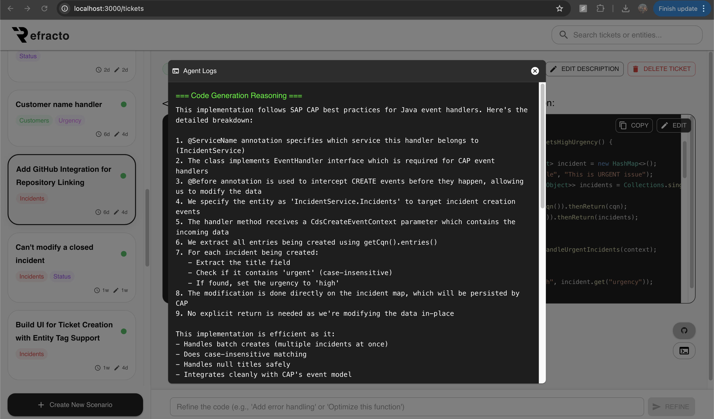
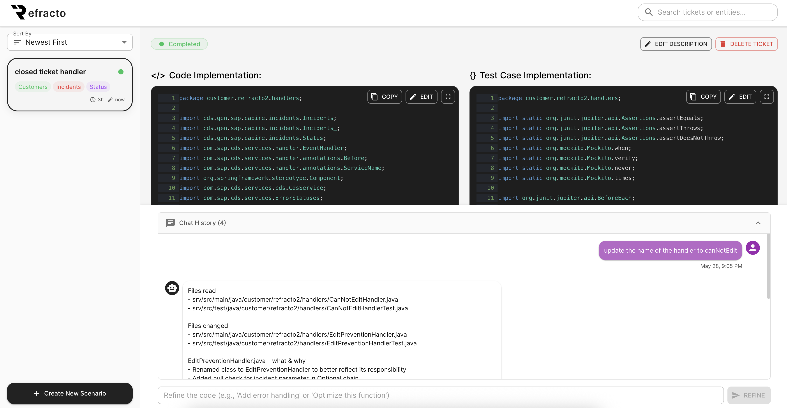

# Refracto 

**Refracto** is an agentic, ticket-driven code generation assistant built for SAP CAP (Cloud Application Programming) projects. It empowers developers and teams to convert plain-language feature requests into production-ready Java code — complete with tests, reasoning, and audit trails.

> ⚡ Accelerate development.  
> 🛡️ Enforce standards.  
> 🔍 Trace every decision.

---

## 🚀 Features

- **Ticket-Driven Development**  
  Create tickets with plain-language prompts and let Refracto generate backend implementations in Java for SAP CAP.


- **Code + Tests + Reasoning**  
  Each response includes:
  - Complete Java code blocks
  - Generated test cases
  - Agent reasoning for both code and test design

- **AI Refinement Flow**  
  Refracto interacts with developers to clarify ambiguous prompts, enabling iterative refinement and question confirmation.

- **GitHub Integration**  
  Automatically commit generated code to specified repositories, supporting branch-based workflows.

- **Audit Trail & Version History**  
  Every generation is timestamped and versioned for traceability.

- **Plug-and-Play Deployment**  
  Built using Node.js, MongoDB, and React. Docker support included for easy cloud or local setup.

---

## 🧱 Architecture

```plaintext
React Frontend
     ↓
Node.js Backend (Express)
     ↓
MongoDB for Session & Ticket Storage
     ↓
Goose / Cline (AI Backend)
